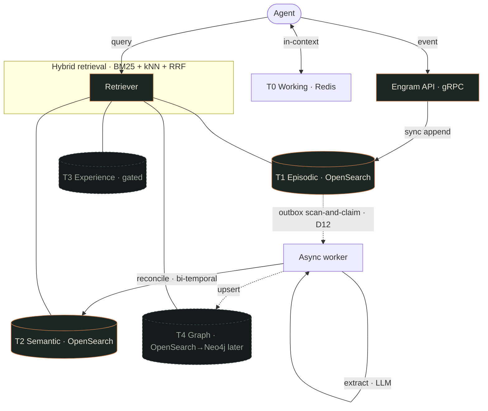

# Plan: Engram — Agent Memory Platform (Walking Skeleton)

**Created:** 2026-06-29
**Amended:** 2026-07-03 — external plan review (codex + antigravity) + scale re-target (S1 team → S2 org)
**Status:** in-progress
**Started:** 2026-07-03 (build worktree: .claude/worktrees/engram-walking-skeleton, branch feature/engram-walking-skeleton)
**Current Phase:** 0
**Complexity:** complex
**Scope of this plan:** Walking skeleton — **Phases 0–2 are build-ready**. Phases 3–7 are roadmapped at vision detail (§Roadmap) and planned just-in-time once the skeleton teaches us the real constraints.

---

## Context

**Problem:** Build a greenfield, mission-critical **agent memory platform** for an engineering team, growing to a few-thousand-engineer org (§Scale model), serving three jobs that ad-hoc approaches and grug-brain-class tools cannot: (1) **task/episodic experience** memory so agents learn what worked/failed and reuse it; (2) a **domain knowledge base** with multi-hop "connect-the-dots" retrieval; (3) **multi-agent shared memory** with scoping, access control, and concurrent-write safety. Long context windows do not substitute for this (BEAM: structured memory beats a 1M-token window by ~75%).

**Why greenfield:** Mem0, Letta, Zep, MemOS, and GraphRAG solve *conversational* memory well but punt on concurrent-write merge, team/org scoping, write-time authorization, and org-scale cost — exactly our hard requirements. We greenfield the storage/scale/ACL/concurrency layers and **port** the solved patterns (reconciliation, incremental bi-temporal ingestion) rather than rebuild them.

**Strategic shape:** a hybrid retrieval backbone on OpenSearch (BM25 + kNN + RRF); a tiered memory model (working / episodic / semantic / experience / graph); an async, LLM-gated write path with bi-temporal reconciliation; and provenance-as-ACL enforced at query time. Full target architecture and grounding: `.code-foundations/research/REFERENCE-ARCHITECTURE.md` and `GREENFIELD-BUILD-PLAN.md`.

## Scale model (added 2026-07-03)

Primary customer: an engineering team; ceiling: a few-thousand-engineer org. Assumes ~200–1,000 memory events per engineer-day.

| Target | Users | Events/day | Cumulative episodes (3y) | Live semantic facts | Vector RAM (1024-dim, SQfp16) |
|--------|-------|-----------|--------------------------|---------------------|-------------------------------|
| **S1 — team** (build & test here) | 10–50 engineers | 10k–50k | 10–50M | 1–5M | 2–10 GB — one modest node |
| **S2 — org** (design ceiling) | ~5,000 engineers | 2–5M | 1–3B | 100–300M | 200–600 GB — a real cluster |

Vector RAM shows raw SQfp16 payload (`2·dim` bytes/vector); for cluster sizing apply the full formula — `1.1·(2·dim + 8·m)` bytes **× replicas** (see GREENFIELD-BUILD-PLAN backbone config).

**Rule: build and test at S1; design seams for S2.** Any gate or sizing claim that says "at scale" must point at one of these rows. Multi-tenancy means **teams within one org**, not cross-org SaaS.

## Constraints

- **Language: Go** (Decision D0; reversible only in Phase 0). I/O-bound service layer; vector compute delegated to OpenSearch/Faiss.
- **Backbone:** OpenSearch **pinned 3.1** (D14 — has `score-ranker-processor` RRF, introduced 2.19; supported by both self-host containers and AWS OpenSearch Service), Faiss HNSW kNN, 1024-dim embeddings + SQfp16 quantization.
- **Mission-critical:** bi-temporal audit is non-negotiable. **Build and test at S1, design seams for S2** (§Scale model): team-within-org scoping and low-billions cumulative episodes at the ceiling — not day-one requirements.
- **Don't reinvent:** port reconciliation (Mem0/Letta) and incremental bi-temporal ingest (Graphiti) patterns; license-check before lifting any code.
- **Cost:** extraction LLM cost is the dominant *variable* line — trivial at S1 (~$10–50/day), real at S2 (~$1–5k/day). The write path must be async and gated, with a hard budget gate (DW-2.6).

## Chosen Approach

**Walking skeleton first.** Build the smallest end-to-end vertical that proves the architecture: ingest an event → extract a fact → reconcile bi-temporally → retrieve it via hybrid search — with the contracts (record schemas, Go interfaces) locked so the later tiers bolt on without a rewrite. Defer experience memory, ACL, graph, scale-hardening, and eval gates to roadmapped phases, but design their seams now.

Rationale: at high uncertainty the slice surfaces the real constraints (OpenSearch RRF behavior, extraction cost, reconciliation edge cases, concurrency) far more cheaply than fully detailing eight phases up front.

## Rejected Approaches

| Approach | Why rejected |
|----------|--------------|
| Adopt Zep/Mem0 (managed or OSS) as-is | Solves conversational memory, not our three jobs; punts on concurrent-write, cross-org ACL, billions-scale cost. Port from, don't adopt. |
| Greenfield all 8 phases detailed now | Over-planning at high uncertainty; phases 3–7 will churn once the skeleton surfaces constraints. |
| Rust | CPU edge wasted on an I/O-bound layer; slower to build; thinner ecosystem for this service shape. Revisit only for a hard p99/no-GC SLA. |
| GraphRAG-style batch graph | Batch community recompute is a non-starter at scale; we use incremental upsert (Graphiti pattern). |
| Vector-only RAG (no BM25) | Misses exact-term recall (IDs, names, codes); Anthropic Contextual Retrieval shows BM25 is additive (35%→49%). Hybrid is the backbone. |

## Assumptions

- An OpenSearch **3.1** cluster (container-pinned for dev/CI; AWS OpenSearch Service also offers 3.1) is reachable; production sizing is a Phase 6 concern.
- Embeddings come from a **co-located BGE-M3 (1024-dim) service** (D15) with a ≤50 ms query-embed budget inside the read SLA; an extraction LLM endpoint is reachable.
- Every `Ingest` call carries a client-supplied `event_id` — the idempotency identity (D13).
- The skeleton runs single-team; tenancy/provenance **fields** exist in all schemas from Phase 0 (D16), enforcement arrives in Phase 4.
- gRPC + protobuf for the service API (Go-native typed contracts); a REST gateway is optional later.

## Decision Log

| ID | Decision | Grounding |
|----|----------|-----------|
| D0 | **Go**, not Rust — **CONFIRMED 2026-07-03 (Phase 0): language locked.** Phase-0 build validated the choice end-to-end: module builds/tests green on Go 1.26, gRPC/protobuf codegen is pure-Go (pinned `go run` buf + protoc-gen-go), OpenSearch 3.1 speaks plain HTTP/JSON (no client-lib risk), and the whole toolchain (revive lint, testcontainer-style spikes) needed zero non-Go host installs. No p99/no-GC pressure surfaced. Reversibility window closes at Phase 1. | I/O-bound orchestration; vector compute delegated to OpenSearch; concurrency + ecosystem + dev speed |
| D1 | Hybrid BM25 + kNN, RRF | Anthropic Contextual Retrieval; OpenSearch/Elastic default |
| D2 | Incremental graph upsert, not batch | Graphiti per-episode; GraphRAG batch is a non-starter |
| D3 | Bi-temporal invalidation (append, never delete) | Zep 4-timestamp + MemOS version chain → audit / point-in-time |
| D4 | Async, LLM-gated write path | Mem0 two-phase; extraction is the cost center |
| D5 | Mandatory write-gating for experience memory | Experience-Following (2505.16067): agents obey retrieved experience (r≈1) |
| D6 | Provenance-as-ACL, query-time enforced | Collaborative Memory bipartite reachability; instant revocation |
| D7 | Concurrent writes → optimistic concurrency + version chain | All papers punt — our contribution |
| D8 | Graph DB only for >2–3 hops | OpenSearch has no native traversal; GeAR triple-expansion for ≤2 hops |
| D9 | Continuous eval harness (HaluMem + following metric) from day one | Memory hallucination is silent |
| D10 | **UPDATE write protocol:** index new fact first (`op_type=create`, carrying a durable `supersedes` link), then guarded close of predecessor; **neighbor-aware insertion** for late arrivals; **repair sweep** with ≤5-min convergence SLO | OpenSearch has no multi-doc transactions; OCC is per-document — atomicity comes from ordering + durable supersession intent + repair. Reads may transiently see two live versions (bounded, documented) |
| D11 | **Content-addressed IDs + explicit chains:** `content_key = sha256(tenant·subject·predicate·object)`; doc `_id = sha256(content_key·valid_at)` via `op_type=create`; version chain = the reconciler-set `supersedes` link | Kills the ADD-vs-ADD race (409 → re-reconcile). Chains must be links, not key equality — UPDATEs change the object (2026-07-03 re-review, codex critical) |
| D12 | **Queue = outbox on episodic** (T1 scan-and-claim with lease); no separate broker in the skeleton; small worker pool + batched claims + low poll cadence to limit Lucene segment churn | T1 is already a durable append-only log; append==enqueue closes the lost-handoff crash window; escalate to a broker if Phase 2 load checks degrade, else revisit at S2 (Phase 6) |
| D13 | **Idempotency identity:** ledger keyed `(tenant_id, event_id, extractor_version)`, **claimed via `op_type=create` before extraction**; extraction output persisted into the ledger before any semantic write; retries resume from the cached extraction | LLM extraction is nondeterministic — a retry must never re-extract (it would orphan near-duplicates); idempotency must be mechanical (2026-07-03 re-review, both reviewers) |
| D14 | OpenSearch **pinned to 3.1 exactly** (dev container, CI, prod); no `normalization-processor` fallback path | One code path; 3.1 has RRF + Faiss SQfp16; AWS OpenSearch Service supports 3.1 (verified 2026-07-03) |
| D15 | Embeddings: **BGE-M3 1024-dim, co-located** (TEI-class serving; exact model artifact + revision pinned in Phase 0); episodic append is text-first, a Phase 1 enrichment job fills embeddings async; query-embed ≤50 ms | 568M params, ~130 emb/s on one A100 (batch 32); hosted APIs add 50–150 ms network — would break the 150 ms read SLA |
| D16 | Scale: build/test at **S1**, seams for **S2** (§Scale model); tenancy + provenance **fields** in all schemas from Phase 0, enforcement in Phase 4 | User re-target 2026-07-03: team → few-thousand-engineer org; fields now avoid the Phase-4 reindex |

---

## Architecture at a glance



The **walking skeleton** builds the solid nodes (API, T1, T2, Retriever). Dashed nodes (T3 Experience, T4 Graph) are roadmap.

### The write-path contract (Phase 2)

```mermaid
sequenceDiagram
    participant Ag as Agent
    participant API
    participant T1 as T1 Episodic
    participant Wk as Worker
    participant LLM
    participant T2 as T2 Semantic
    Ag->>API: event (+ required event_id)
    API->>T1: append (sync, cheap — the append IS the enqueue, D12)
    Wk->>T1: scan-and-claim unprocessed (lease + attempts)
    Wk->>LLM: extract facts
    Wk->>T2: hybrid search top-k candidates
    Wk->>LLM: decide ADD / UPDATE / INVALIDATE / NOOP
    alt UPDATE
        Wk->>T2: 1. index NEW fact (op_type=create) · 2. set old.invalid_at = new.valid_at (guarded)
    else ADD
        Wk->>T2: index new fact (op_type=create; 409 → re-reconcile)
    end
    Note over Wk,T2: never hard-delete · 4 timestamps · write protocol D10/D11 · repair sweep converges partial writes
```

### Bi-temporal semantics (normative — D3)

- **Valid time** (real world): half-open `[valid_at, invalid_at)`; `invalid_at = null` means still valid. Stamped from event content when extractable, else the event's `created_at`.
- **Transaction time** (system): half-open `[created_at, expired_at)`; `expired_at = null` means current record. `expired_at` marks *record-level* retraction/correction (this row superseded **as a record**), distinct from real-world invalidation.
- **Current-state query:** `valid_at ≤ now < coalesce(invalid_at, +∞) AND expired_at == null`.
- **As-of query (the audit contract):** `valid_at ≤ V < coalesce(invalid_at, +∞) AND created_at ≤ T < coalesce(expired_at, +∞)`.
- **Late arrivals are legal:** a new fact may carry `valid_at` earlier than existing facts' — the reconciler orders by valid time, not arrival order.
- Writers stamp system time (`created_at`/`expired_at`); agents never set it.
- **Documented deviation:** closing `invalid_at` is the one permitted in-place mutation (Zep-style). To preserve transaction-time audit of that mutation we stamp `invalidated_tx_at` alongside it; full row-versioned closure (append a new closed row + expire the old) is deferred until an as-of consumer actually needs it.

### Write protocol (normative — D10 / D11 / D13; revised after 2026-07-03 re-review)

**IDs & chain metadata:**
- `content_key = sha256(tenant_id · subject · predicate · object)` — stored field, used for duplicate detection.
- Semantic doc `_id = sha256(content_key · valid_at)` — content-addressed: identical concurrent extractions collide (409) instead of duplicating.
- `supersedes: <doc_id> | null` — set by the reconciler on UPDATE/INVALIDATE. **The version chain is this explicit link, not key equality** — an UPDATE usually changes the object, so successive versions have different content keys.

**Steps (worker, per claimed event):**
1. **Claim the ledger entry** `(tenant_id, event_id, extractor_version)` with `op_type=create`. Already exists & complete → stop. Exists & incomplete (crashed run) → adopt its **cached extraction** and resume at step 3 — a retry never re-calls the LLM (extraction is nondeterministic; re-extraction would orphan near-duplicate facts).
2. **Extract, then persist the extraction result into the ledger entry** — before any semantic write.
3. Per fact: reconcile against candidates, then **index the NEW fact first** (`op_type=create`, `supersedes` set for UPDATE/INVALIDATE). 409 → another worker won: re-read, re-reconcile (usually NOOP).
4. **Close the predecessor:** set `invalid_at = new.valid_at` + `invalidated_tx_at = now`, guarded by `if_seq_no`/`if_primary_term`; conflict → re-read, bounded retry. **Late arrival:** if `new.valid_at < predecessor.valid_at`, do NOT touch the predecessor — the new fact is historical: bound it at index time by its valid-time successor (`new.invalid_at = successor.valid_at`). Neighbor-aware insertion; intervals must never invert.
5. **Mark each action complete in the ledger**; mark the entry complete when all actions land.

**Repair sweep** (scheduled; convergence SLO ≤5 min at S1): (a) live facts whose `supersedes` target is still live → complete step 4; (b) >1 live fact sharing a `content_key` → keep the earliest, close the rest; (c) ledger entries incomplete past lease expiry → resume from their cached extraction. **Bounded consistency (documented):** between steps 3 and 4 a query may transiently see two live versions of one chain; the read path tolerates this and the sweep bounds the window.

---

## Implementation Phases (Walking Skeleton)

### Phase 0: Foundations & Contracts
**Model:** fable
**Skills:** ca-architecture-boundaries, aposd-designing-deep-modules
**Gate:** Standard
**Depends on:** none

**Goal:** Lock the contracts and stand up a building, tested, deployable shell — schemas, interfaces, OpenSearch templates, and an eval harness — so Phases 1–2 implement against fixed seams.

**Scope:**
- IN: Go module + CI (`build`+`test`+lint incl. `revive` exported-comment rule); the `Store`/`Retriever`/`Extractor`/`Reconciler`/`Embedder` Go interfaces; the `api/proto/engram.proto` contract + codegen (required `event_id` on `Ingest`); the **ID & idempotency contract** (content keys, doc-`_id` scheme, the `supersedes` chain, claim-first extraction-ledger design — D11/D13); record structs + OpenSearch index templates (episodic incl. outbox fields `processed_at`/`claim_lease_until`/`attempts`, semantic) with tenancy/provenance fields on both (`tenant_id`, `team_id`, `scope`, `owner_agent_id`, `source_ids[]` — D16, dumb single-team values for now); the RRF search pipeline + kNN method config (Faiss + SQfp16 asserted); an idempotent "apply templates to a dev cluster" script; **three live-cluster spikes** (`op_type=create` 409 flow · RRF pipeline shape · filtered-kNN recall); eval-harness skeleton with a seed gold set (**pre-registered train/holdout split**); confirm/flip D0 (language).
- OUT: any real retrieval or write logic (Phases 1–2); experience/ACL/graph schemas (roadmap).

**Edge cases:** cluster version ≠ pinned 3.1 → apply script fails with a clear message (one code path, no fallback — D14); embedding dim mismatch vs index template → validated at startup.

**Produces:** `internal/memory` record types (Episodic incl. outbox + tenancy fields; SemanticFact with the four bi-temporal timestamps + lineage key); `internal/store` interface `Store` — `Append(ctx, Record) (id string, err error)`, `Create(ctx, id string, f SemanticFact) error` (`op_type=create`, 409 surfaced as `ErrConflict`), optimistic-concurrency `Update(ctx, id string, f SemanticFact, ifSeqNo, ifPrimaryTerm int64) error`, the **outbox seams** (`ClaimBatch(ctx, n, lease)` / `Complete(ctx, eventID)` / `DeadLetter(ctx, eventID, reason)`), the **ledger seams** (`ClaimLedger(ctx, key)` / `UpdateLedger(ctx, key, state)`), and the **repair scan** (`ScanIncomplete(ctx)`) — the write seams all later phases share — + index-template JSON; `internal/retrieval` interface `Retriever`; `internal/ingest` interfaces `Extractor`, `Reconciler`; `internal/embed` interface `Embedder` (`Embed(ctx, []string) ([][]float32, error)`; reports model/dim/revision, validated at startup); the `api/proto/engram.proto` service contract (`Ingest` with required `event_id`, `Search` RPCs); a green CI pipeline. **These interface + RPC signatures are the seams Phases 1–2 consume.**

**Done when:**
- [ ] DW-0.1: clean checkout runs `go build ./...` and `go test ./...` green in CI.
- [ ] DW-0.2: `Store`, `Retriever`, `Extractor`, `Reconciler`, `Embedder` interfaces compile with doc-comment contracts (enforced by `revive`'s exported-comment rule).
- [ ] DW-0.3: Episodic + SemanticFact structs + matching OpenSearch index templates checked in; a test asserts knn_vector 1024-dim, `engine: faiss`, HNSW `m`/`ef_construction`, **SQfp16 encoder**, BM25 text, bi-temporal date fields, tenancy/provenance fields, and episodic outbox fields.
- [ ] DW-0.4: apply-templates script creates indices + the RRF pipeline on a dev OpenSearch idempotently; re-running is a no-op.
- [ ] DW-0.5: eval-harness skeleton loads a seed gold set (query → expected ids) and emits recall@k (returns 0 until Phase 1 — harness exists and runs).
- [ ] DW-0.6: D0 (Go) explicitly confirmed or flipped; language locked in this plan's Decision Log.
- [ ] DW-0.7: `api/proto/engram.proto` (`Ingest` with required `event_id`, `Search` RPCs) compiles via codegen in CI; generated Go builds.
- [ ] DW-0.8: the ID & idempotency contract (content-key scheme, doc-`_id` format, `supersedes` chain, claim-first ledger design — D11/D13) is documented in the code and reflected in the record structs.
- [ ] DW-0.9: the three live-cluster spikes run green against the pinned cluster and their findings are logged (op_type=create 409 flow · RRF pipeline behavior · filtered-kNN recall).

### Phase 1: Hybrid Retrieval Backbone (T1 + T2)
**Model:** sonnet
**Skills:** aposd-designing-deep-modules, cc-routine-and-class-design
**Gate:** Standard
**Depends on:** Phase 0

**Goal:** Implement `Retriever` over OpenSearch — ingest (append) and a hybrid BM25+kNN query fused by RRF, with validity + scope filters — and prove fusion beats either signal alone.

**Scope:**
- IN: OpenSearch `Store` impl; the gRPC server implementing `Ingest` (sync append) + `Search` (hybrid retrieval); append to **episodic only** — T2 is seeded from a static fact dataset by the harness for retrieval tests (no synchronous semantic writes in the API; they arrive via the Phase 2 worker); `Retriever.Search` (hybrid query → RRF → optional rerank hook); the episodic **embedding-enrichment job** (append is text-first per D15; a background embedder fills `text_embedding`, BM25 serves not-yet-enriched docs); query-time filters (`invalid_at`/`expired_at` null, `tenant_id` + `user_id`); wire the eval harness to measure recall.
- OUT: extraction/reconciliation (Phase 2); rerank model training; multi-tenant ACL beyond a single `user_id` filter.

**Edge cases:** empty query; zero results; filtered-kNN recall collapse (use `efficient_filter`); embedding service timeout (degrade to BM25-only, flagged).

**Produces:** the running gRPC service — `Ingest` (sync append, returns durable id) + `Search` (hybrid) — with `Retriever.Search(ctx, Query, Filter) ([]Hit, error)` implemented and indices applied. **Contract:** `Hit{ID, Score, Source, Fields}`; `Filter{TenantID, UserID string; ValidOnly bool}`. Phase 2 extends `Ingest` with async enqueue and writes into the same indices via `Store`.

**Done when:**
- [ ] DW-1.1: gRPC `Ingest` appends an event to episodic and returns a durable id; a subsequent `Search` returns it — end-to-end client round-trip (via BM25 immediately; kNN-searchable once the enrichment job fills the embedding, lag ≤30 s in the dev harness).
- [ ] DW-1.2: hybrid query (BM25 clause + kNN clause → RRF pipeline) returns a single fused ranked list.
- [ ] DW-1.3: on the **pre-registered held-out split** of the gold set (≥50 queries), hybrid recall@10 ≥ max(BM25-only, kNN-only) − 2 pp (non-inferiority), with MRR and nDCG@10 reported alongside; any query class where fusion loses is analyzed in the harness log.
- [ ] DW-1.4: every result respects the validity filter and `tenant_id` + `user_id` scope filters; filtered-kNN recall measured at ≥3 filter selectivities and verified not to collapse.
- [ ] DW-1.5: p95 query latency ≤ 150 ms **under the defined perf harness**: warm pinned cluster, ≥100k seeded docs, 8 concurrent clients, measured at the gRPC boundary *including* query embedding (co-located budget ≤50 ms); p50/p95/p99 + error rate reported; runs in the perf environment, not CI.
- [ ] DW-1.6: `Retriever.Search` covered by table-driven tests + ≥1 dirty test (empty query / no results / embedding timeout → BM25 fallback).

### Phase 2: Async Write & Bi-temporal Reconciliation
**Model:** fable
**Skills:** aposd-verifying-correctness, cc-defensive-programming, aposd-designing-deep-modules
**Gate:** Full (data-integrity & concurrency critical — wrong reconciliation silently corrupts memory)
**Depends on:** Phase 1

**Goal:** Close the loop — event → sync episodic append → async extract → reconcile (ADD/UPDATE/INVALIDATE/NOOP) writing bi-temporally to semantic, idempotent and concurrency-safe.

**Scope:**
- IN: the **outbox worker pool** (scan-and-claim leased batches of unprocessed episodic events — D12; lease expiry, bounded `attempts`, dead-letter marker); `Extractor.Extract` (LLM → candidate facts, cheap-model path); the extraction ledger with claim-first + cached-extraction resume (D13); candidate retrieval against T2; `Reconciler.Reconcile` (the four-way decision); bi-temporal writes per the **write protocol** (D10/D11: create-first, guarded invalidate, repair sweep); extraction-cost metrics.
- OUT: experience distillation + write-gating (Phase 3); graph upsert (Phase 5); RL-learned memory management (roadmap).

**Edge cases:** contradictory facts within one batch (deterministic resolution); malformed/empty LLM extraction (reject, don't index); duplicate event replay (ledger short-circuit); two workers reconciling overlapping facts (guarded-invalidate conflict → re-read + bounded retry; duplicate ADD → `op_type=create` 409 → re-reconcile); worker crash mid-transition (repair sweep converges); LLM timeout (retry with backoff, dead-letter after N).

**Produces:** `Extractor.Extract(ctx, []Event) ([]Fact, error)`; `Reconciler.Reconcile(ctx, Fact, []Candidate) (Op, error)` with `Op ∈ {Add, Update, Invalidate, Noop}`; the async worker. **Contract:** an UPDATE indexes a new `SemanticFact` and sets the prior fact's `invalid_at = new.valid_at`.

**Done when:**
- [ ] DW-2.1: the worker claims unprocessed episodic events via the outbox (lease + attempts); kill-and-restart the service at any point after the sync append → the event is still eventually processed (no lost handoff).
- [ ] DW-2.2: async worker extracts facts and retrieves top-k candidates from semantic.
- [ ] DW-2.3: reconciler emits ADD/UPDATE/INVALIDATE/NOOP; UPDATE writes a new fact + sets prior `invalid_at = new.valid_at` (4 timestamps), never hard-deletes.
- [ ] DW-2.4: replaying the same `event_id` short-circuits at the ledger; a crash-resumed event applies the **cached** extraction (LLM not re-called — verified by call count); a bumped `extractor_version` reprocess produces no duplicate live facts (content-key dedup) — idempotency is mechanical, not LLM-behavioral.
- [ ] DW-2.5: N parallel workers on overlapping facts produce no lost updates (guarded close), **no duplicate live content keys** (`op_type=create` 409 path exercised), and divergent concurrent UPDATEs of one predecessor converge to a single live head (repair sweep); verified by a race/concurrency test.
- [ ] DW-2.6: extraction cost per 1k events measured and **gated ≤ $5/1k events** on the cheap-model path (S1 budget; list price of the pinned extraction model on a fixed synthetic workload; batching counts toward it).
- [ ] DW-2.7: dirty test — contradictory in-batch facts resolve deterministically; malformed extraction is rejected, not indexed.
- [ ] DW-2.8: crash-recovery test — worker killed between new-fact index and predecessor close → repair sweep completes the close via the `supersedes` link (exactly one live head); killed after extraction but before writes → resumes from the cached ledger extraction; killed before the ledger claim → the outbox retries cleanly. Late-arrival test: a historical fact inserts with a bounded interval; no inverted intervals, predecessor untouched.

---

## Roadmap (Phases 3–7 — plan just-in-time)

Vision detail only; each becomes its own plan when the skeleton reaches it. Full design + grounding in `.code-foundations/research/GREENFIELD-BUILD-PLAN.md`.

**Ordering note (2026-07-03):** for a team-of-engineers deployment, Phase 4 (scope + ACL) may deliver value before Phase 3 (experience memory) — shared, scoped team knowledge is the first product surface. Decide the order at Phase 2 exit.

**Superseded (2026-07-03):** Phases 3–8 are now fully planned to build-ready depth in [`2026-07-03-engram-production.md`](2026-07-03-engram-production.md) (surface-first ordering: surfaces/auth/e2e → ACL → experience ∥ graph → production ops → eval gates). The table below remains as vision history.

```mermaid
gantt
    title Engram roadmap
    dateFormat X
    axisFormat %s
    section Walking skeleton (now)
    P0 Foundations & contracts      :done,    p0, 0, 1
    P1 Hybrid backbone (T1+T2)      :active,  p1, 1, 2
    P2 Async write + reconcile      :active,  p2, 3, 2
    section Roadmap (next)
    P3 Experience memory + gating   :         p3, 5, 2
    P4 Multi-agent scope + ACL      :         p4, 7, 2
    P5 Incremental graph (T4)       :         p5, 9, 2
    P6 Scale & ops hardening        :         p6, 11, 2
    P7 Eval & safety gates          :         p7, 13, 2
```



| Phase | Goal | Headline done-when |
|-------|------|--------------------|
| **3 Experience/Skill memory** | T3 record + distillation + **mandatory write-gate** + utility prune | bad experiences gated (injected-bad test); curated-small beats large A/B; following-correlation tracked |
| **4 Multi-agent scope + ACL** | provenance-as-ACL, concurrent-write merge, version chain | revocation hides fragments at query time; concurrent conflict resolves losslessly; full audit trail |
| **5 Incremental graph (T4)** | entity/edge upsert + dedup + ≤2-hop expansion | single-episode ingest, no recompute; connect-the-dots query works; entity count stable on repeats |
| **6 Scale & ops** | sharding, off-heap RAM, quantization, hot/cold, cost controls | load test at target within latency+RAM+cost budget; failover drill passes |
| **7 Eval & safety** | HaluMem suite + experience-following metric in CI | hallucination measured + gated; a bad release blocked in a drill |

---

## Test Coverage

**Level:** 100% of done-when items, with ≥1 dirty (error-path) test per code-touching phase. Integration tests run against a disposable OpenSearch (testcontainers) behind a build tag.

## Test Plan

- [ ] P0: CI runs build+test+lint on clean checkout (DW-0.1); `revive`'s exported-comment rule asserts doc-comments on the interface packages (DW-0.2); a script/unit test asserts required index-template fields — knn_vector 1024-dim, `engine: faiss`, SQfp16 encoder, bi-temporal date fields, tenancy + outbox fields (DW-0.3); apply-templates idempotency test (DW-0.4); harness loads seed set + emits recall@k (DW-0.5); proto codegen with required `event_id` runs in CI (DW-0.7); ID/idempotency contract reflected in structs (DW-0.8); three live-cluster spikes pass and are logged (DW-0.9); version-guard test rejects any cluster ≠ pinned 3.1 (edge).
- [ ] P1: gRPC Ingest→Search round-trip (DW-1.1); hybrid fusion returns single list (DW-1.2); non-inferiority vs best single signal on the held-out split, MRR/nDCG reported (DW-1.3); validity + tenant scope honored, filtered-kNN recall at ≥3 selectivities (DW-1.4); p95 ≤150 ms in the perf harness — not CI (DW-1.5); dirty: empty query / embedding-timeout→BM25 fallback (DW-1.6).
- [ ] P2: outbox claim + kill-and-restart handoff test (DW-2.1); extract+candidate retrieval (DW-2.2); UPDATE sets prior invalid_at, no delete (DW-2.3); ledger replay + cached-extraction resume + content-key idempotency (DW-2.4); race test incl. duplicate-ADD 409 + divergent-UPDATE convergence (DW-2.5); cost gate ≤ $5/1k events on the fixed workload (DW-2.6); dirty: contradictory-batch determinism + malformed-extraction rejection (DW-2.7); crash-recovery repair-sweep + late-arrival interval test (DW-2.8).

---

## Notes

- **Open questions (resolve in Phase 0/1):** cheap extraction model choice; rerank model (defer — leave a hook). *Resolved 2026-07-03:* embedding = BGE-M3 1024-dim co-located (D15); OpenSearch pinned 3.1 — available self-hosted and on AWS OpenSearch Service, so managed-vs-self-hosted no longer blocks anything (D14).
- **Deferred by design:** graph DB adoption (Phase 5 decides OpenSearch-edges vs Neo4j by hop depth); the **quarantine tier** for poisoned experiences is unsolved in the literature — it's net-new design in Phase 3.
- **Port, don't rebuild:** lift reconciliation decision logic from Mem0/Letta and incremental bi-temporal ingest from Graphiti (license-check first).
- **Reversible-now:** D0 (Go) is cheap to flip only before Phase 1 code lands.

---

## Execution Log
_To be filled during /code-foundations:build_
