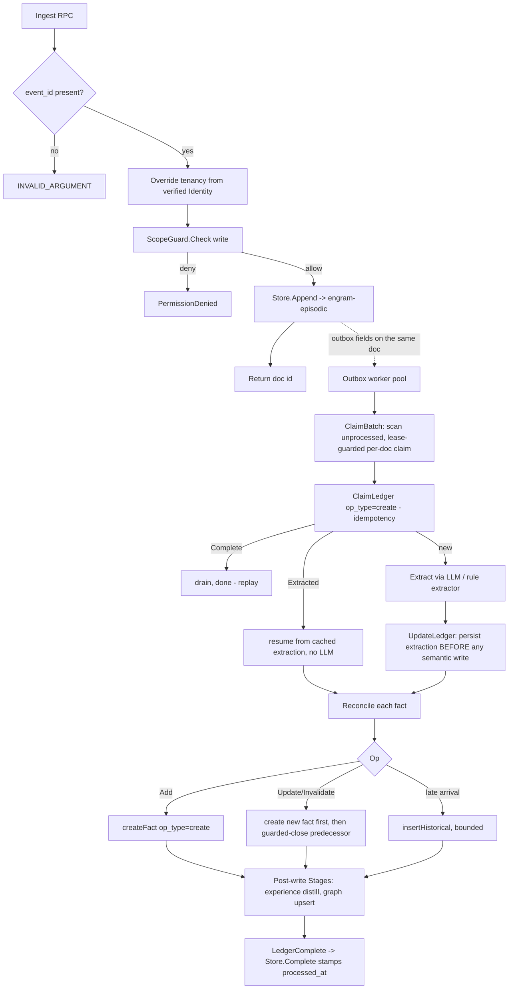
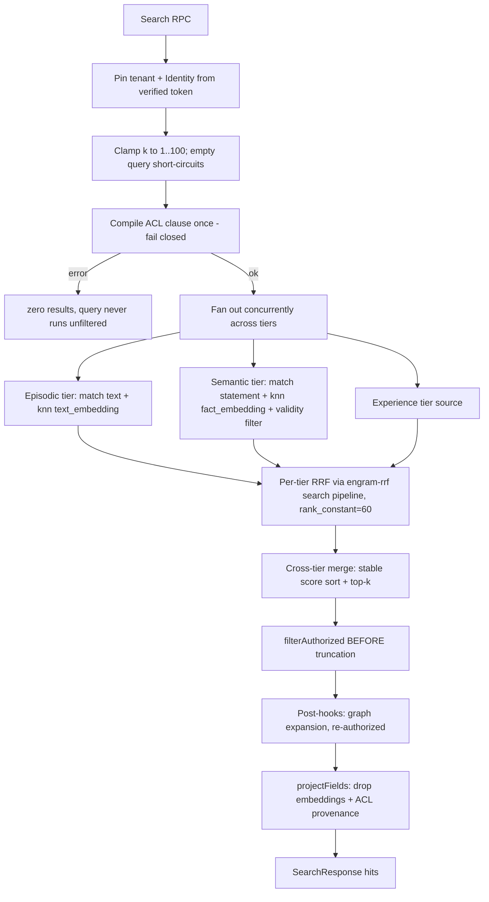

# Engram — Application Architecture

Engram is an agent-memory platform: a single gRPC service backed by OpenSearch that
provides hybrid retrieval, tiered memory with asynchronous LLM-gated writes, a
document "knowledge" platform, and provenance-as-ACL access control.

This document describes the system **as built**. Where it differs from the README's
forward-looking framing, the code is authoritative; drifts are called out in
[Known doc/code drift](#known-doccode-drift).

- **Stack:** Go 1.25 · OpenSearch 3.1 (pinned) · Faiss HNSW kNN + BM25 + RRF ·
  BGE-M3 1024-dim embeddings · gRPC/protobuf.
- **API contract:** [`api/proto/engram.proto`](../api/proto/engram.proto).
- **Interface reference:** [`docs/api.md`](./api.md).

---

## 1. Components at a glance

| Component | Binary / package | Responsibility |
|---|---|---|
| **Service daemon** | `cmd/engram-server` | The one production process: gRPC server, outbox worker pool, repair sweep, enrichment job, `/metrics`. |
| gRPC handlers | `internal/server` | Handlers over a Store (write) and Retriever (read) seam; agnostic to OpenSearch. Derives all tenancy from the verified identity. |
| Write seam + store | `internal/store` | Durable OpenSearch write path; owns index templates, the cluster contract, the outbox/ledger, ACL-edge & auth-token stores, and the knowledge collection registry. |
| Read seam | `internal/retrieval` | Hybrid search: per-tier BM25 + kNN fused by RRF, cross-tier merge, ACL enforcement, response projection. |
| Write vocabulary | `internal/ingest` | Extractor + reconciler seams and the four-way reconciliation vocabulary (`Noop/Add/Update/Invalidate`); cost metering. |
| Async worker | `internal/worker` | Outbox worker pool + repair sweep: claim → ledger → extract → reconcile → bi-temporal land. |
| Enrichment | `internal/enrich` | Backfills `text_embedding` on text-first episodic docs so they become kNN-searchable. |
| Tier schemas | `internal/memory` | Record schemas and deterministic ID/key derivation (SHA-256); no OpenSearch. |
| Graph tier | `internal/graph` | Incremental entity/edge graph: per-episode upsert with dedup + bounded ≤2-hop expansion. |
| Experience tier | `internal/experience` | Task-experience memory as a trust boundary with a mandatory write-gate (admit/quarantine/reject). |
| Access control | `internal/acl` | Provenance-as-ACL: query-time read filter + write-time scope guard, fail-closed. |
| Auth | `internal/auth`, `internal/authgrpc` | Opaque bearer tokens (hash-only storage); the gRPC interceptor barricade that resolves identity. |
| Knowledge auth | `internal/knowledgeauth` | Per-collection RBAC from role claims (`AuthorizeRead`/`AuthorizeWrite`). |
| Knowledge domain | `internal/knowledge` | Collection specs, field specs, access policy, document types (no OpenSearch). |
| Embedding | `internal/embed` | Embedder port + TEI-style HTTP impl and a deterministic fake; startup dimension gate. |
| Telemetry | `internal/telemetry`, `internal/telemetrygrpc` | OTel/Prometheus RED metrics, cost kill-switch, gated extractor. |
| Client library | `internal/engramclient` | Shared gRPC client for the CLI, MCP server, and harvester; attaches the bearer token. |

Surrounding tooling binaries (`engram`, `engram-harvester`, `engram-mcp`,
`engram-apply-templates`, `engram-embed-server`, `engram-extract-shim`,
`engram-stub-llm`, `engram-eval`, `engram-goldgen`, `engram-perf`,
`engram-loadtest`, `engram-deploy`) are catalogued in [`docs/api.md`](./api.md).

---

## 2. Service assembly

`cmd/engram-server/main.go` wires the whole system in `main()`:

1. **Cluster contract** — `store.Apply` PUTs every index template + the RRF search
   pipeline and creates the concrete indices idempotently; it **refuses any cluster
   that is not OpenSearch 3.1** (`PinnedVersionPrefix = "3.1."`). `EnsureIndices`
   then validates the configured index names against their template prefixes.
2. **Embedder** — `-embed-url` set → `embed.HTTPEmbedder` (TEI-style); empty →
   `embed.FakeEmbedder` (deterministic). Validated against `store.EmbeddingDim`
   (1024) at startup; a dimension mismatch fails the boot.
3. **ACL** — `store.NewACLEdgeStore` feeds `acl.NewFilter` (read filter) and
   `acl.NewScopeGuard` (write guard, registered on the store). Scope is enforced at
   both read and write.
4. **Store & Retriever** — `store.NewOpenSearchStore` (write) and
   `retrieval.NewOpenSearchRetriever` (read), the latter carrying the ACL filter and
   the tier→index map.
5. **Auth** — `store.NewAuthTokenStore` → `auth.NewAuthenticator`.
6. **Background jobs** — episodic embedding enrichment (`enrich.Job`), the outbox
   worker pool (`worker.New(...).Run`), the repair sweep (`worker.Sweeper`), a cost
   logger, the experience prune job, and the telemetry recorder.
7. **Extractor** — `-extract-url` → `ingest.HTTPExtractor`, else a deterministic
   `ingest.RuleExtractor`; wrapped in `telemetry.GatedExtractor` behind a cost
   `KillSwitch` that fails closed on a budget breach.

**Interceptor chain** (applied outermost-first):

```
telemetrygrpc.UnaryServerInterceptor   # RED metrics on every call, pre-auth
  → authgrpc.UnaryServerInterceptor     # the auth barricade: verify bearer token,
                                        #   inject Identity, else opaque Unauthenticated
    → server handlers                    # assume an Identity is present
```

A single `server.Server` implements the entire `engrampb.EngramServer` (memory +
knowledge), assembled from seams: `Probe`, `Auditor`, `ACL`, `Registry`,
`KnowledgeWriter`, `KnowledgeReader`, `Episodic`, `Exporter`.

---

## 3. Memory tiers and backing indices

| Tier | Purpose | Concrete index (dev) | Vector field |
|---|---|---|---|
| Working | Conversational/context — not persisted as an Engram tier | — | — |
| **Episodic (T1)** | Raw appended events; doubles as the outbox | `engram-episodic-000001` | `text_embedding` (1024-d) |
| **Semantic (T2)** | Extracted, bi-temporal facts | `engram-semantic-000001` | `fact_embedding` (1024-d) |
| **Experience (T3)** | Gated task-experience records | `engram-experience-000001` (+ `-quarantine-000001`) | — |
| **Graph (T4)** | Deduplicated entities + typed edges | `engram-graph-entities-000001`, `engram-graph-edges-000001` | — |

**Supporting indices:** extraction ledger `engram-ledger-000001`, auth tokens
`engram-auth-tokens-000001`, ACL edges `engram-acl-edges-000001`, and the knowledge
collections registry `knowledge-collections-000001` (data indices are
`knowledge-<name>-vN` behind a `knowledge-<name>` alias).

Index templates are checked-in JSON, `//go:embed`-ed in `internal/store/templates.go`.
The episodic/semantic/ledger/auth/acl/knowledge-registry templates + the RRF pipeline
are applied by `store.Apply`; the T3 and T4 templates are applied separately by
`experience.Apply` and `graph.Apply` during their wiring.

---

## 4. The write path

Ingest is a **synchronous episodic append that is itself the enqueue** for the async
extraction pipeline — the episodic index doubles as the outbox.



Key invariants:

- **Idempotency (D13):** one ledger row per `LedgerKey{tenant_id, event_id,
  extractor_version}` (doc `_id` = SHA-256 of those). Claim-first with
  `op_type=create`; a replay short-circuits, and an already-`Extracted` event
  **resumes from the cached extraction and never re-calls the LLM**. Replayed appends
  of the same `event_id` drain the outbox too.
- **Concurrency safety:** `ClaimBatch` claims each doc with a guarded
  `_update?if_seq_no&if_primary_term`; the 409 loser skips, so two workers never both
  win the same event.
- **Bi-temporal writes:** facts carry valid time `[valid_at, invalid_at)` and
  transaction time `[created_at, expired_at)`. UPDATE/INVALIDATE **creates the new
  version first** (durable, `supersedes` set) and only then guarded-closes the
  predecessor; the close bound is neighbor-aware. Late arrivals insert bounded
  historical records without touching the live head. **Nothing is ever hard-deleted.**
- **Repair sweep:** a periodic `Sweeper` converges partial writes (half-done closes,
  divergent siblings, past-lease incomplete ledgers, closed-closed overlaps) —
  convergence SLO ≤5 min.

---

## 5. The read path

`Search` fuses BM25 and kNN per tier via RRF, merges tiers, and enforces ACL and
bi-temporal validity — all before results cross the wire.



Details:

- **Filters are pushed inside both the BM25 and kNN sub-queries** (never
  post-filtered) — this preserves filtered-kNN recall. Each tier query ANDs the ACL
  clause, a `tenant_id` term, an optional `owner_agent_id` term, and — semantic only —
  the bi-temporal current-state filter (`ValidOnly`, derived server-side from the
  request's `include_superseded`; default `false` keeps today's current-facts-only
  behavior). `SearchRequest` also carries nine flat filter params — `kind`,
  `subject`, `predicate`, `object`, `extractor_version`, `since`, `until`,
  `include_superseded`, `sources` — compiled to predicates at the barricade (see
  `internal/server/searchfilter.go`); the retired `valid_only` request field
  (proto field 5) is now reserved.
- **Fusion is per-tier, not cross-tier.** Each tier fuses its own BM25 + kNN with RRF
  server-side; the two fused lists are then merged by a stable score sort. Cross-tier
  score normalization is a documented non-goal.
- **Read-side embedding is bounded to 50 ms.** On timeout/error the tier degrades
  gracefully from hybrid to BM25-only rather than failing the query.
- **Projection is last.** Embeddings and ACL/provenance fields are excluded
  server-side and never reach the client.

`Read` and `Audit` are the deliberate by-id drill-downs (full episodic text, or a
semantic fact + provenance + bi-temporal history). They run the same fail-closed
authorization as `Search`: an unknown id, a cross-tenant record, or an id/source
mismatch all return `NOT_FOUND` — no existence oracle.

---

## 6. Access control — provenance-as-ACL

ACL is enforced at both query time and write time (defense in depth), fail-closed
everywhere. Scopes are `private` / `team` / `org` (empty = private).

- **Reachability** is resolved fresh on every call from the `engram-acl-edges` store
  (`Reach{Agents, Teams, OrgGrant}`) — **no caching**, so a revocation bites on the
  next call. Self is always reachable; an empty agent set denies all.
- **Read filter** (`acl.Enforcer.Clause`) emits an OpenSearch bool filter ANDed inside
  every tier query: `tenant_id` + a `should` over three scope branches (private = own
  `owner_agent_id`; team = `owner_agent_id ∈ agents` AND `team_id ∈ teams`; org =
  `owner_agent_id ∈ agents`). Its in-Go twin `Authorize(Record)` re-filters
  tier-source and graph hits.
- **Write guard** (`acl.ScopeGuard.Check`) gates every append: private → any valid
  identity; team → member of the target team; org → holds the org grant; unknown
  scope → error. Denials surface as `PermissionDenied`.

The knowledge platform uses a **separate RBAC layer** (`internal/knowledgeauth`):
`AuthorizeRead(public, roles)` / `AuthorizeWrite(role)` against the identity's role
claims. Roles come only from the verified token, never from request fields.

---

## 7. The knowledge platform

The knowledge platform shares the OpenSearch cluster but **never touches the memory
tiers**. It is the deliberate deviation from memory's append-only model:

| | Memory tiers | Knowledge platform |
|---|---|---|
| Write model | Append-only, never overwrite | Upsert-by-id (`_bulk` `index`) |
| Delete | Never hard-delete (bi-temporal close) | Mark-and-sweep hard delete |
| Retrieval | BM25 + kNN + RRF, tier fusion | BM25 only (filters + sort) |
| Extraction | Async LLM extraction → facts | None; documents stored as-is |
| Access | Scope/provenance ACL | Role-based (RBAC) per collection |

Collections are runtime-mutable (create/update with no restart). The
`CollectionRegistry` (`internal/store/registry.go`) is durable in the
`knowledge-collections-000001` meta-index with an in-process whole-set cache
invalidated on write. A field-type change reindexes to `v<N+1>` and atomically swaps
the alias. The platform is fed by `engram-harvester`, which calls only the
`Knowledge*` RPCs.

---

## 8. Embedding

Embedding is **co-located by contract, pluggable by config**. `embed.HTTPEmbedder`
POSTs `{baseURL}/embed` with a TEI-style `{"inputs":[...]}` body and expects
index-aligned `[][]float32`. `engram-server` uses it only when `-embed-url` is set;
otherwise it runs a deterministic `FakeEmbedder`.

- Default model `BAAI/bge-m3`, **1024-dim**, validated against `store.EmbeddingDim` at
  startup (fails boot on mismatch).
- `cmd/engram-embed-server` is a deterministic TEI-compatible stand-in for the
  co-located BGE-M3 service, used by the local e2e stack; production swaps a real
  BGE-M3 container behind the same `-embed-url`.
- Write-side fact embedding is best-effort (BM25 serves the fact if embedding fails;
  the enrichment job backfills it). Read-side embedding is bounded to 50 ms.

---

## 9. Deployment topology

**Local (`deploy/local/docker-compose.yml`):** OpenSearch 3.1.0 (host `9201:9200`),
`engram-embed-server` (`:8081`), `engram-stub-llm` (`:8082`), and engramd (host
`7071:7070`). The host-side extraction shim is intentionally not a compose service.

> ⚠️ The local compose stack doubles as a live personal memory store. `make e2e` /
> `make e2e-down` run `docker compose down -v` and **wipe the OpenSearch volume**. See
> [`docs/mcp.md`](./mcp.md) for the safe teardown path.

**AWS (`cmd/engram-deploy` + `deploy/aws/`):** an idempotent Go converge (no
Terraform) of an OpenSearch Service 3.1 domain + 3 ECS services (engramd, worker,
co-located BGE-M3) + Secrets Manager + VPC, per environment (`staging` / `prod`),
with `-rollback`. LocalStack compose and CloudWatch dashboards/alerts live under
`deploy/aws/`.

**Observability:** engramd exposes Prometheus metrics at `:9464/metrics` only; there
is no HTTP health endpoint on the daemon — health is the gRPC `Status` RPC (surfaced
as `engram status` / `memory_status`).

---

## Known doc/code drift

| Drift | Reality |
|---|---|
| `cmd/engramd` referenced in the README and several doc comments | Empty directory, no `main.go`. The real daemon is `cmd/engram-server`. |
| `docs/mcp.md` documents 3 MCP tools (`memory_ingest`/`search`/`status`) | The code exposes **10** tools — 4 memory + 6 knowledge. See [`docs/api.md`](./api.md). |
| README "co-located embeddings" | True by contract, but the running service uses the **fake embedder** unless `-embed-url` is provided. |
